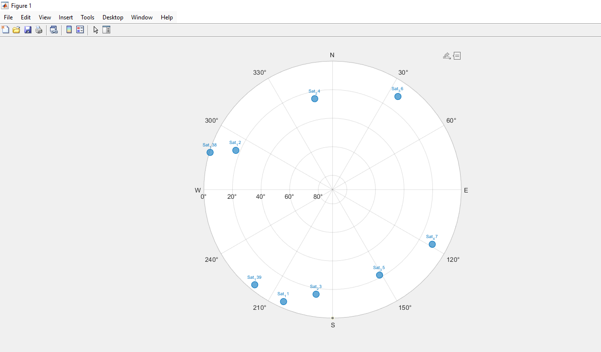

# Satellite Constellation Design and Link Performance

A MATLAB-based simulation and communication-link analysis of a
Walker-Star Low Earth Orbit (LEO) satellite constellation.

## Project Overview

This project was completed as part of Satellite Communication Systems
Engineering at RMIT University.

The project involved designing and simulating a 144-satellite
Walker-Star LEO constellation consisting of 12 orbital planes with
12 satellites per plane.

A ground station was established at RMIT University's Melbourne City
Campus, and MATLAB was used to investigate satellite visibility,
range, link-budget performance and theoretical Bit Error Rate (BER).

## Tools

- MATLAB
- Satellite Communications Toolbox

## Key Areas

- LEO satellite constellation modelling
- Walker-Star constellation design
- Ground station access analysis
- Azimuth, elevation and range calculations
- Satellite link-budget analysis
- Free-space path loss
- Eb/N0 analysis
- Bit Error Rate analysis
- 4-PSK and 16-QAM comparison

## Constellation Design

The simulated constellation consisted of:

- 144 satellites
- 12 orbital planes
- 12 satellites per plane
- 950 km orbital altitude
- Walker-Star configuration

## Ground Station and Satellite Access

A ground station was modelled at RMIT University's Melbourne City
Campus. Satellite visibility was analysed using MATLAB, and visible
satellites were evaluated according to their azimuth, elevation and
range.

## Skyplot

A skyplot was generated to visualise the positions of visible
satellites relative to the ground station.

## Link Budget Analysis

The closest visible satellite was selected for the communication
link analysis.

The analysis included:

- Free-space path loss
- Antenna gain
- Received signal power
- Noise power spectral density
- Signal-to-noise ratio
- Eb/N0

## Modulation and BER Analysis

The theoretical BER performance of 4-PSK and 16-QAM was compared
using MATLAB.

The results demonstrated the trade-off between communication
reliability and higher-order modulation.

## What I Learned

This project strengthened my understanding of the relationship
between satellite orbital geometry and communication-system
performance. It also developed my practical MATLAB skills in
satellite modelling, link-budget calculations, data analysis and
visualisation.

## Author

Md Fuad Fahimul Haque

Master of Engineering (Electrical and Electronic Engineering)  
RMIT University
